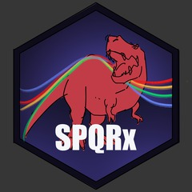

# SPQRX 

SPQRX (Semi-Parametric Quantile Regression for eXtremes) performs
bulk-and-tail density regression using neural networks. The package
implements the methodology from [this paper on
arXiv](https://arxiv.org/abs/2504.19994), and is built around the
`keras3` library in `R`.

## Installation

You can install the development version of SPQRX from
[GitHub](https://github.com/) with:

``` r
# install.packages("devtools")
devtools::install_github("reetamm/SPQRX")
```
