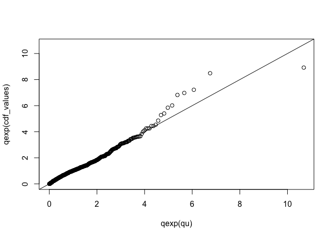
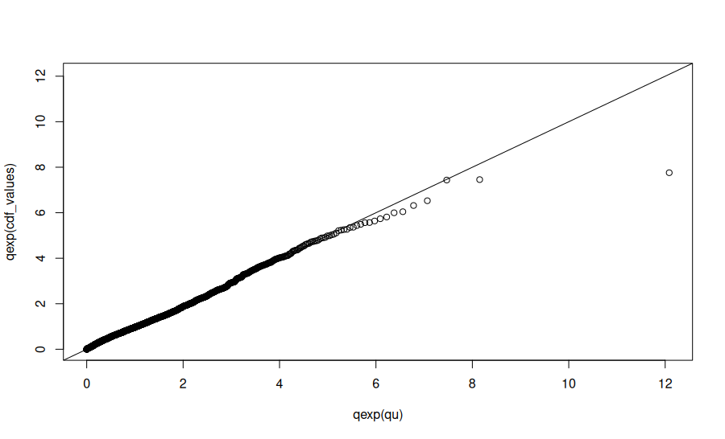

<<<<<<< HEAD

<!-- README.md is generated from README.Rmd. Please edit that file -->

# SPQRX 

SPQRX (Semi-Parametric Quantile Regression for eXtremes) performs
bulk-and-tail density regression using neural networks. The package
implements the methodology from [Majumder and Richards
(2026)](https://link.springer.com/article/10.1007/s10687-026-00533-y),
and is built around the `keras3` library in `R`.

> 🚧 **Warning!**
>
> This package is currently under development, and several functions
> might not work as intended.

# Installation

You can install the development version of SPQRX from GitHub with:

``` r
# install.packages("devtools")
devtools::install_github("reetamm/SPQRX")
```

A minimum working example of fitting an SPQRX model to housing data in
Arkansas, US, is provided below.

``` r
library(SPQRX)

# Import the Arkansas housing prices dataset
dataset <- housing


y <- matrix ( dataset$price, ncol = 1)

x <- as.matrix(dataset[, c('bedrooms', 'batchrooms', 'squareFeet', 'lon', 'lat')])

data <- preprocessing.data(x, y, n.knots = 25, testing_ratio = 0.2, valid_ratio = 0.2)
=======
### SPQRX
SPQRX is keras base R library for quantile regression and density, introduce in the paper "Semi-parametric bulk and tail regression using spline-based neural networks" By Reetam, Jordan PhD(https://arxiv.org/abs/2504.19994)


```r
library(SPQRX)

# Import in some dataset
dataset <- read.csv('/home/dalton/Downloads/housing (1).csv')


coords <- strsplit(gsub("POINT \\(|\\)", "", dataset$geometry), " ")

# Convert to numeric matrix
coords <- do.call(rbind, lapply(coords, function(x) as.numeric(x)))

# Assign to new columns
dataset$lon <- coords[,1]
dataset$lat <- coords[,2]


y <- matrix ( dataset$price, ncol = 1)
y <- y

dataset <- dataset[, names(dataset) != "price"]

x <- as.matrix(dataset[, c('bedrooms', 'bathrooms', 'squareFeet', 'lon', 'lat')])

data <- preprocessing.data(x, y, n.knots = 25)
>>>>>>> origin/merging-dalton

x_training <- data$x_training
x_validation <- data$x_validation
x_testing <- data$x_testing

y_training <- data$y_training
y_validation <- data$y_validation
y_testing <- data$y_testing

<<<<<<< HEAD
p_a = 0.95
p_b = 0.999
c1 = 30
=======


p_a = 0.95
p_b = 0.999
c1 = 35
>>>>>>> origin/merging-dalton
c2 = 5

hyperparameter <- create.packages.hyperparameter(p_a = p_a , p_b = p_b , c1 = c1, c2 = c2)

model.heavy <- fit_spqrx(input_dim = 5, hidden_dim = c(45 , 45), n.knots = 25, x_training = x_training, 
<<<<<<< HEAD
                   x_validation = x_validation, y_training = y_training, y_validation = y_validation,
                   hyperparameter = hyperparameter, pre_train = F)
```

``` r
# evaluate model fit
eval.plot.qexp(model.heavy, x_testing, y_testing)
```


=======
                   x_validation = x_validation, y_training = y_training, y_validation = y_validation, hyperparameter = hyperparameter)

eval.plot.qexp(model.heavy, x_testing, y_testing)


cdf_values <- predict_spqrx(model.heavy , x_training[101, ], y_training, type = 'QF', tau = 0.95)


eval.plot.QVI(model.heavy, x_training , var.indexs = c(1,  3, 4, 5))


x_explain <- x_testing[1:20, ]
y_explain <- y_testing[1:20,]


# Only for quantile define tau = 
shapley_report <- eval.explain.shapr(model , x_training, x_testing[c(10:20),], tau = 0.5)

lime_analysis <- eval.explain.lime(model.heavy, x_training, x_testing[c(10: 20), ], tau = 0.5)

eval.explain.VI(model.heavy, x_training, var.indexs = c(1, 2, 3, 4,5), tau = 0.5)

eval.plot.shap(model.heavy, x_training, x_testing[c(100:120), ])
```

This will end up generating the following extreme quantile regression plot giving one a good idea of the extreme tails. 



>>>>>>> origin/merging-dalton
