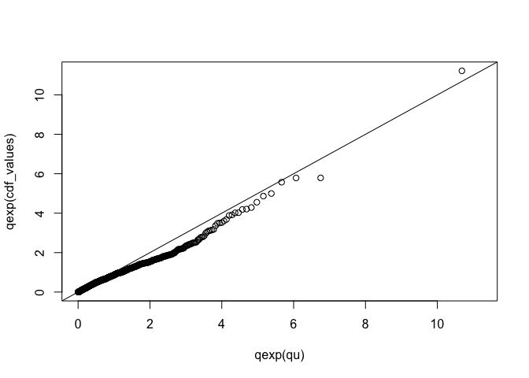

# SPQRX 

SPQRX (Semi-Parametric Quantile Regression for eXtremes) performs
bulk-and-tail density regression using neural networks. The package
implements the methodology from [Majumder and Richards
(2026)](https://link.springer.com/article/10.1007/s10687-026-00533-y),
and is built around the `keras3` library in `R`.

> 🚧 **Warning!**
>
> This package is currently under development, and several functions
> might not work as intended.

## Installation

You can install the development version of SPQRX from
[GitHub](https://github.com/) with:

``` r
# install.packages("devtools")
devtools::install_github("reetamm/SPQRX")
```

A minimum working example of fitting an SPQRX model to housing data in
Arkansas, US, is provided below.

``` r
library(SPQRX)

# Import the Arkansas housing prices dataset
dataset <- housing


y <- matrix ( dataset$price, ncol = 1)

x <- as.matrix(dataset[, c('bedrooms', 'batchrooms', 'squareFeet', 'lon', 'lat')])

data <- preprocessing.data(x, y, n.knots = 25, testing_ratio = 0.2, valid_ratio = 0.2)

x_training <- data$x_training
x_validation <- data$x_validation
x_testing <- data$x_testing

y_training <- data$y_training
y_validation <- data$y_validation
y_testing <- data$y_testing

p_a = 0.95
p_b = 0.999
c1 = 30
c2 = 5

hyperparameter <- create.packages.hyperparameter(p_a = p_a , p_b = p_b , c1 = c1, c2 = c2)

model.heavy <- fit_spqrx(input_dim = 5, hidden_dim = c(45 , 45), n.knots = 25, x_training = x_training, 
                   x_validation = x_validation, y_training = y_training, y_validation = y_validation,
                   hyperparameter = hyperparameter)
```

``` r
# evaluate model fit
eval.plot.qexp(model.heavy, x_testing, y_testing)
```

    ## Warning in mSpline(y, knots = knots, Boundary.knots = c(0, 1), intercept = TRUE, : Some 'x' values beyond boundary knots may cause ill-conditioned basis
    ## functions.
    ## Warning in mSpline(y, knots = knots, Boundary.knots = c(0, 1), intercept = TRUE, : Some 'x' values beyond boundary knots may cause ill-conditioned basis
    ## functions.
    ## Warning in mSpline(y, knots = knots, Boundary.knots = c(0, 1), intercept = TRUE, : Some 'x' values beyond boundary knots may cause ill-conditioned basis
    ## functions.
    ## Warning in mSpline(y, knots = knots, Boundary.knots = c(0, 1), intercept = TRUE, : Some 'x' values beyond boundary knots may cause ill-conditioned basis
    ## functions.
    ## Warning in mSpline(y, knots = knots, Boundary.knots = c(0, 1), intercept = TRUE, : Some 'x' values beyond boundary knots may cause ill-conditioned basis
    ## functions.

<!-- -->
